# NetBox Load Balancing
The NetBox Load Balancing plugin enables NetBox to manage operational load balancing services.

## Objectives
NetBox Load Balancing is designed to be the 'Load Balancing Source of Truth' analogous to NetBox being the 'Network Source of Truth'.

The plugin stores information about Load Balancing Services, Listeners, Pools, Health Monitors and Members, 
making it a data source for automatic provisioning of Load Balancing Services.

This plugin models itself based on 
the OpenStack [Load Balancing as a Service](https://docs.openstack.org/mitaka/networking-guide/config-lbaas.html) definitions.

Main features include:

* Virtual Pools and IPs
* Services, used to define a Load Balancing service.
* Load Balancing Listeners
* Load Balancing Pools
* Load Balancing Health Monitors
* Load Balancing Pool Members


## Installation and Configuration
The installation of plugins in general is described in the [NetBox documentation](https://netbox.readthedocs.io/en/stable/plugins/).

### Requirements
The installation of NetBox Load Balancing requires a Python interpreter and a working NetBox deployment. The following versions are currently supported:

* NetBox 4.2.0 or higher
* Python 3.10 or higher

### Compatibility
NetBox Load Balancing is compatible with the following NetBox versions.

| NetBox Version | NetBox Load Balancing Version |
|----------------|-------------------------------|
| NetBox 4.2     | \>= 1.0.1                     |
| NetBox 4.3     | \>= 1.1.0                     |


### Installation of NetBox Load Balancing
NetBox Load Balancing is available as a PyPi module and can be installed using pip:

```
$ source /opt/netbox/venv/bin/activate
(venv) $ pip install netbox-load-balancing
```
This will install NetBox DNS and all prerequisites within the NetBox virtual environment.

### Adding NetBox Load Balancing to the local NetBox requirements
To ensure that NetBox Load Balancing is updated when a NetBox update is performed,  include it in the local requirements file for NetBox:

```
echo netbox-load-balancing >> /opt/netbox/local_requirements.txt
```
If the local requirements file does not exist, this command will create it.

This will guarantee that NetBox Load Balancing will be updated every time the update script provided with NetBox is executed.

### Enabling the Plugin
In configuration.py, add `netbox_load_balancing` to the PLUGINS list:

```
PLUGINS = [
    'netbox_load_balancing',
]
```

### Running the Django database migration procedure
NetBox Load Balancing requires some tables for its data models within the NetBox database to be present. Execute the following command to create and update these tables:

```
/opt/netbox/netbox/manage.py migrate
```

### Restarting NetBox
Restart the WSGI service and the request queue worker to load the new plugin:

```
systemctl restart netbox netbox-rq
```
Now NetBox Load Balancing should show up under "Load Balancing" at the bottom of the left-hand side of the NetBox web GUI. If you with the plugin to show up under the "Plugins" menu, you can set
the following settings within your Netbox Configuration:

```
PLUGINS_CONFIG = {
    'netbox_load_balancing': {
        'top_level_menu': False,
    },
}
```

### Reindexing Global Search
In order for existing NetBox Load Balancing objects to appear in the global search after the initial installation or some upgrades of NetBox Load Balancing, 
the search indices need to be rebuilt. This can be done with the command

```
/opt/netbox/netbox/manage.py reindex netbox_load_balancing
```
This can be done at any time, especially when items that should show up in the global search do not.


## Object types

NetBox Load Balancing can manage seven different object types: 

* VirtualIPPool
* VirtualIP
* LBService
* Listener
* Pool
* HealthMonitor
* Member


In addition, further object types are using to handle Many-to-Many relationships with Netbox Device, VirtualDeviceContext, Prefix and IPRange object types. 
These assignment objects are:

* LBServiceAssignment -> VirtualIP, Device and VirtualDeviceContext
* VirtualIPPool -> IPRange or Prefix
* PoolAssignment -> LBService
* HealthMonitorAssignment -> Pool
* MemberAssignment -> Pool and HealthMonitor


### Prefix and IP Range Associations

Virtual Pools can be associated to Prefixes and IP ranges for the purposes of forming a relationship between the Load Balancing object 
and the related IPAM object, the ability to create these relationships is handled on the relevant IPAM view.
A series of association 'cards' have been placed on these views to allow for these to be created or viewed.

### ScreenShots

Prefixes
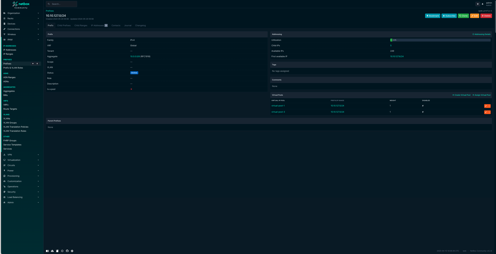

IP Ranges
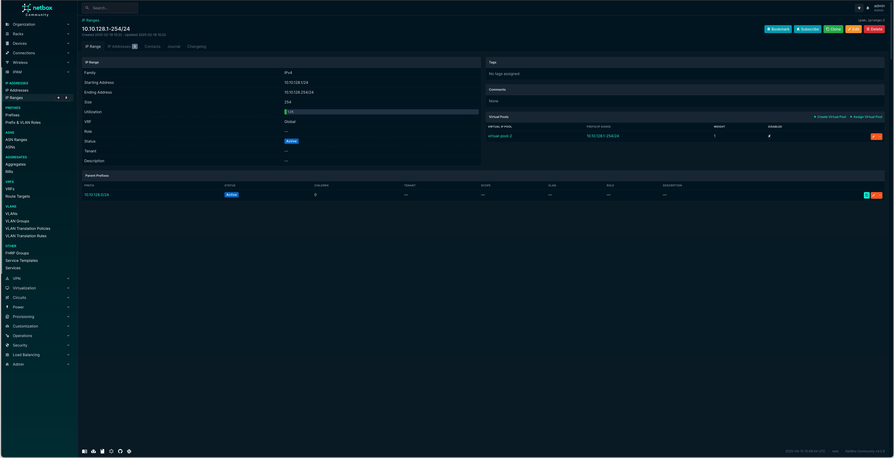


### Device and Virtual Device Context Associations

Services can be associated to Device and Virtual Device Contexts for the purposes of forming a relationship between the Load Balancing object 
and the related DCIM object, the ability to create these relationships is handled on the relevant DCIM view.
A series of association 'cards' have been placed on these views to allow for these to be created or viewed.

### ScreenShots

Devices
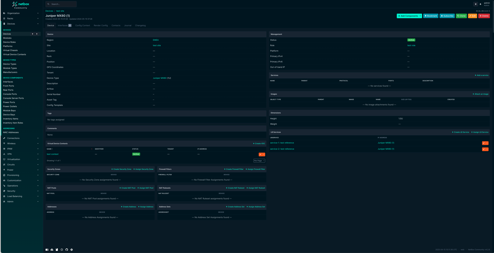

IP Ranges
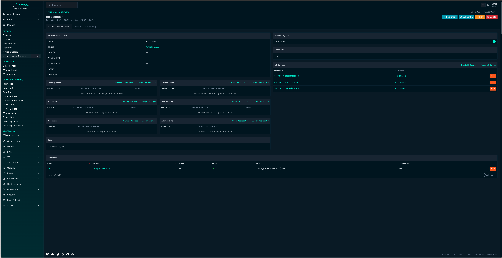


### Pool, Member and Health Monitor Associations

Pools can be associated to an LBService.
Members can be associated with a Pool or with a Health Monitor.
Health Monitors can be associated with a Pool.

The same principle applies as with other associations and this is performed from the relevant view.


### Load Balancing Virtual IP Pools and Virtual IPs

Virtual IP Pools are abstracted pools of IP Addresses. They are associated with Prefixes and IP Ranges, from which Virtual IPs can be allocated.

Virtual IP Pool assignments are stored within the VirtualIPPoolAssignment table.

A Virtual IP is an abstracted IP Address, linked to a Netbox IP Address. 
When creating a Virtual IP, if an IP Address is not defined, one will be allocated from the associated Virtual IP Pool, 
providing there are free IPs within the associated Prefixes or IP Ranges.

An optional DNS name can be provided which is added to the IP Address.

Virtual IPs can be assigned to Load Balancing Services.


#### Permissions

The following Django permissions are applicable to VirtualIPPool objects:

| Permission                                   | Action                  |
|----------------------------------------------|-------------------------|
| `netbox_load_balancing.add_virtualippool`    | Create new view objects |
| `netbox_load_balancing.change_virtualippool` | Edit view information   |
| `netbox_load_balancing.delete_virtualippool` | Delete a view object    |
| `netbox_load_balancing.view_virtualippool`   | View view information   |

The following Django permissions are applicable to VirtualIPPoolAssignment objects:

| Permission                                             | Action                  |
|--------------------------------------------------------|-------------------------|
| `netbox_load_balancing.add_virtualippoolassignment`    | Create new view objects |
| `netbox_load_balancing.change_virtualippoolassignment` | Edit view information   |
| `netbox_load_balancing.delete_virtualippoolassignment` | Delete a view object    |
| `netbox_load_balancing.view_virtualippoolassignment`   | View view information   |

The following Django permissions are applicable to VirtualIP objects:

| Permission                               | Action                  |
|------------------------------------------|-------------------------|
| `netbox_load_balancing.add_virtualip`    | Create new view objects |
| `netbox_load_balancing.change_virtualip` | Edit view information   |
| `netbox_load_balancing.delete_virtualip` | Delete a view object    |
| `netbox_load_balancing.view_virtualip`   | View view information   |

#### ScreenShots

Virtual Pools
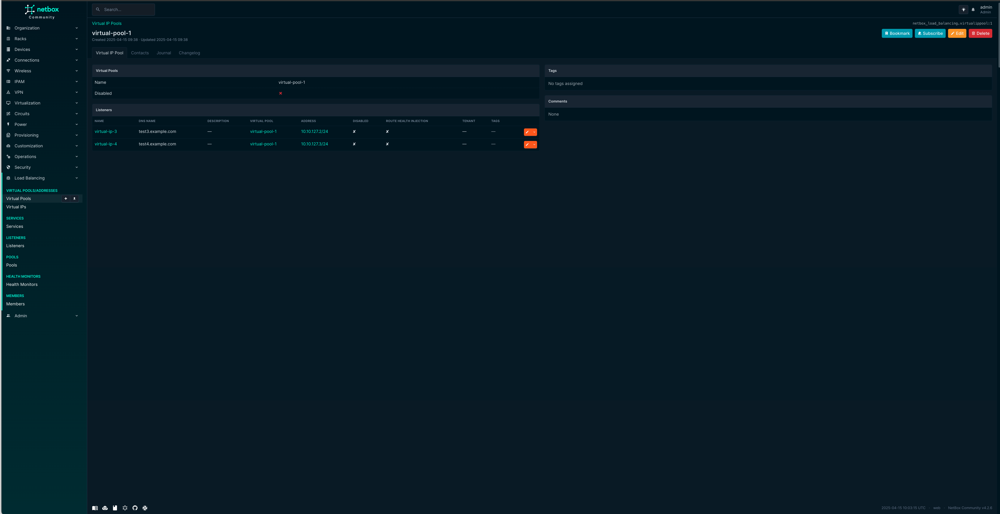
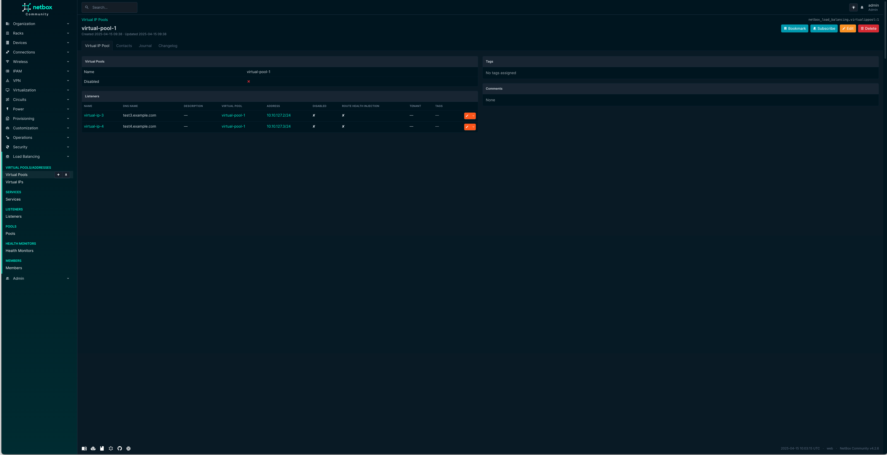

Virtual IPs
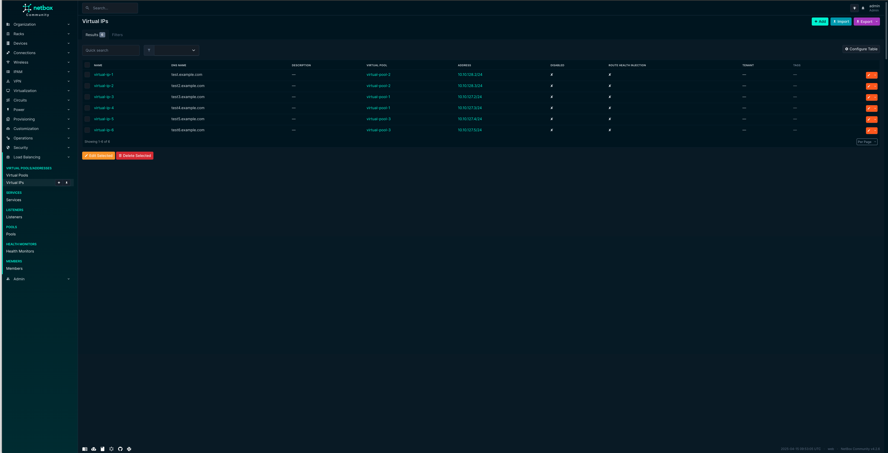
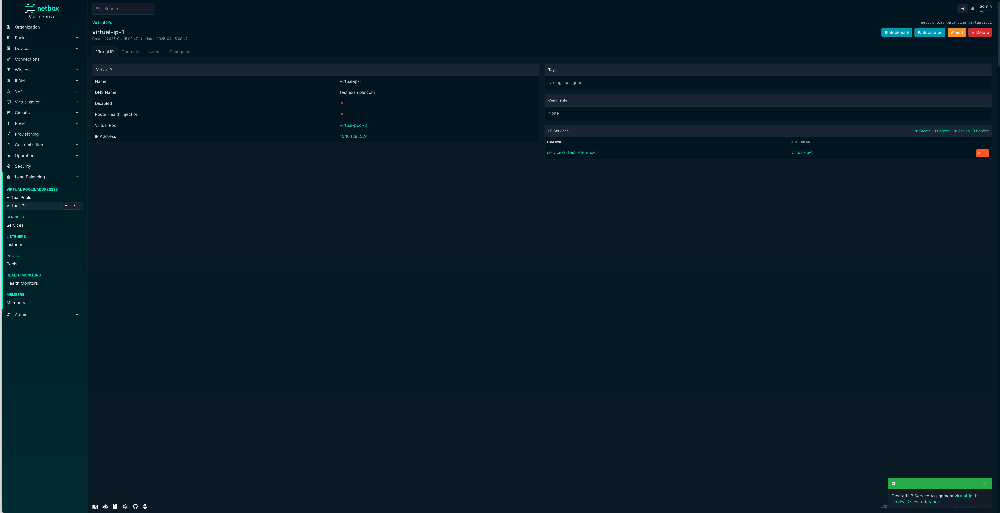


### Load Balancing Services

A Load Balancing Service is a service that runs on a load balancer, 
offering a method of forwarding load balanced traffic to a collection of end receiving hosts.

Traffic flows in the following manner:

End User -> Virtual IP -> Service (Listeners) -> Pools (Members)

An LBService model represents a load balancer service, from which other models are aligned.

The mapping between Virtual IPs and Services is storing in the LBServiceAssignment table and can be configured from the Virtual IP view.
The mapping between Devices and Services is storing in the LBServiceAssignment table and can be configured from the Device view.
The mapping between Virtual Device Contexts and Services is storing in the LBServiceAssignment table and can be configured from the Virtual Device Context view.


#### Permissions

The following Django permissions are applicable to LBService objects:

| Permission                                | Action                  |
|-------------------------------------------|-------------------------|
| `netbox_load_balancing.add_lbservice`     | Create new view objects |
| `netbox_load_balancing.change_lbservice`  | Edit view information   |
| `netbox_load_balancing.delete_lbservice`  | Delete a view object    |
| `netbox_load_balancing.view_lbservice`    | View view information   |


The following Django permissions are applicable to LBServiceAssignment objects:

| Permission                                         | Action                  |
|----------------------------------------------------|-------------------------|
| `netbox_load_balancing.add_lbserviceassignment`    | Create new view objects |
| `netbox_load_balancing.change_lbserviceassignment` | Edit view information   |
| `netbox_load_balancing.delete_lbserviceassignment` | Delete a view object    |
| `netbox_load_balancing.view_lbserviceassignment`   | View view information   |


#### ScreenShots

Services
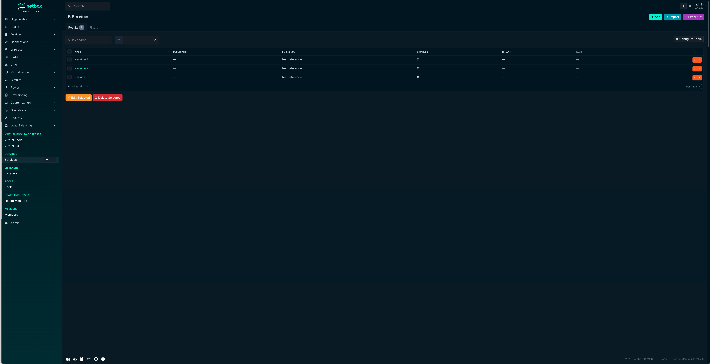
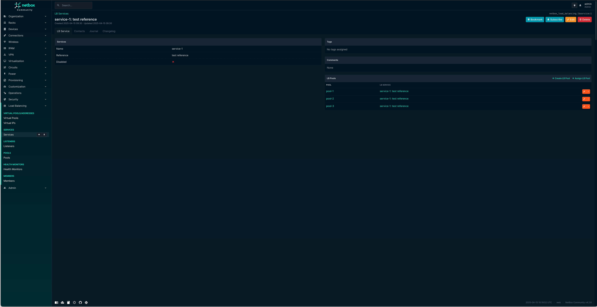


### Load Balancing Listeners, Pools and Members

In Netbox Load Balancing, a pool can have 1 or more listeners. 
It can also be assigned to one or more Load Balancing Services.

Load Balancing pool assignments are stored within the PoolAssignment table.

Members are assigned to pools and health monitors.

Pool Member assignments are stored within the MemberAssignment table. 

#### Permissions

The following Django permissions are applicable to Load Balancing Listener objects:

| Permission                             | Action                  |
|----------------------------------------|-------------------------|
| `netbox_load_balancing.add_listener`    | Create new view objects |
| `netbox_load_balancing.change_listener` | Edit view information   |
| `netbox_load_balancing.delete_listener` | Delete a view object    |
| `netbox_load_balancing.view_listener`   | View view information   |

The following Django permissions are applicable to Load Balancing Pool objects:

| Permission                         | Action                  |
|------------------------------------|-------------------------|
| `netbox_load_balancing.add_pool`    | Create new view objects |
| `netbox_load_balancing.change_pool` | Edit view information   |
| `netbox_load_balancing.delete_pool` | Delete a view object    |
| `netbox_load_balancing.view_pool`   | View view information   |

The following Django permissions are applicable to Pool Member objects:

| Permission                           | Action                  |
|--------------------------------------|-------------------------|
| `netbox_load_balancing.add_member`    | Create new view objects |
| `netbox_load_balancing.change_member` | Edit view information   |
| `netbox_load_balancing.delete_member` | Delete a view object    |
| `netbox_load_balancing.view_member`   | View view information   |

The following Django permissions are applicable to PoolAssignment objects:

| Permission                                   | Action                  |
|----------------------------------------------|-------------------------|
| `netbox_load_balancing.add_poolassignment`    | Create new view objects |
| `netbox_load_balancing.change_poolassignment` | Edit view information   |
| `netbox_load_balancing.delete_poolassignment` | Delete a view object    |
| `netbox_load_balancing.view_poolassignment`   | View view information   |

The following Django permissions are applicable to MemberAssignment objects:

| Permission                                     | Action                  |
|------------------------------------------------|-------------------------|
| `netbox_load_balancing.add_memberassignment`    | Create new view objects |
| `netbox_load_balancing.change_memberassignment` | Edit view information   |
| `netbox_load_balancing.delete_memberassignment` | Delete a view object    |
| `netbox_load_balancing.view_memberassignment`   | View view information   |


#### ScreenShots

Load Balancing Listeners
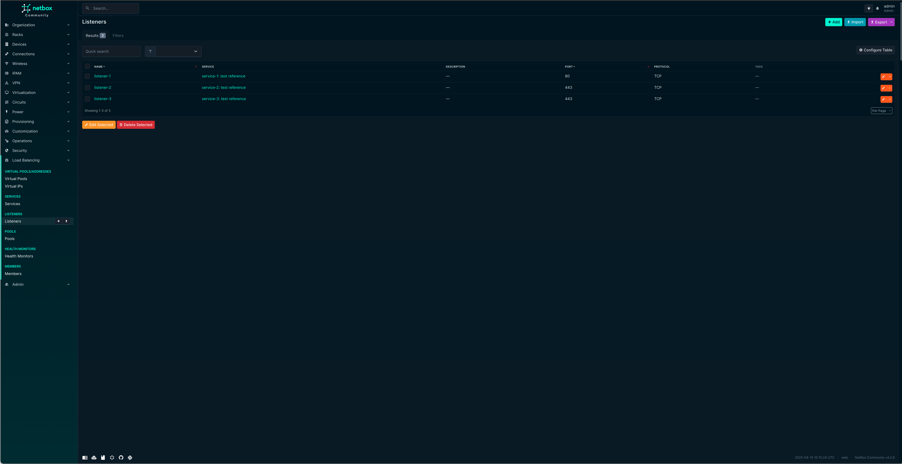
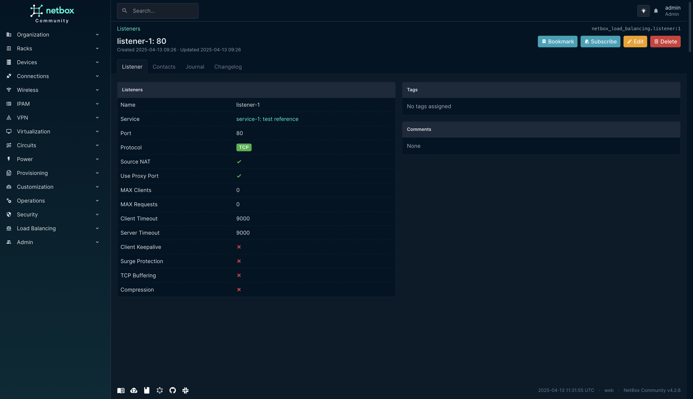

Load Balancing Pools

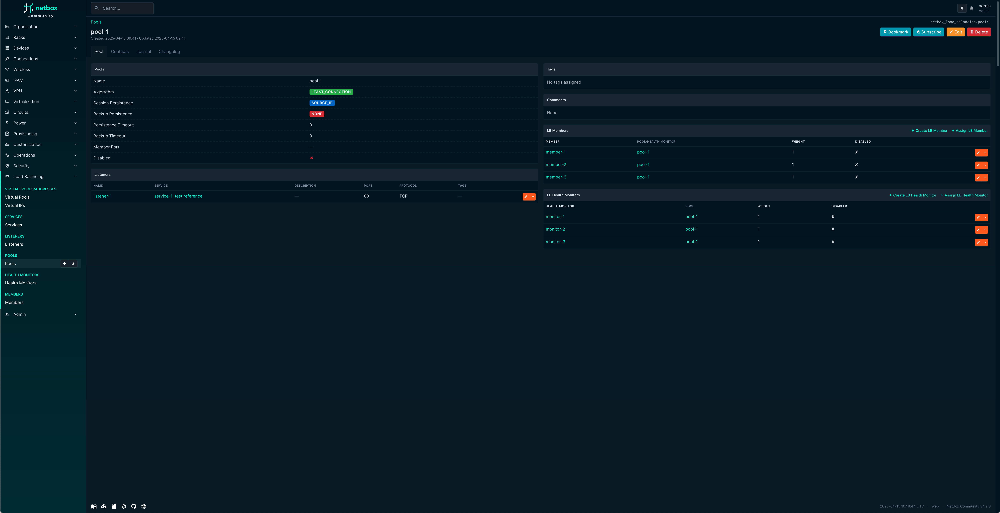

Load Balancing Members
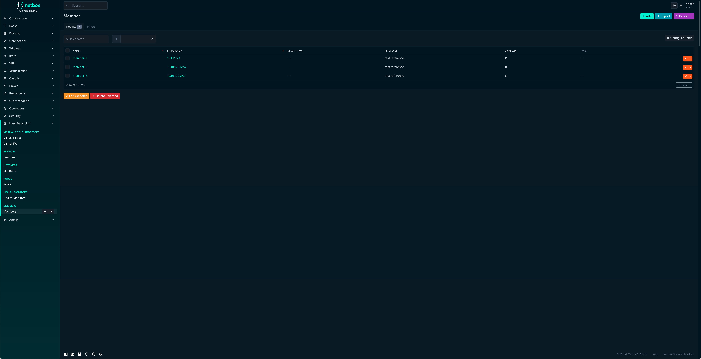
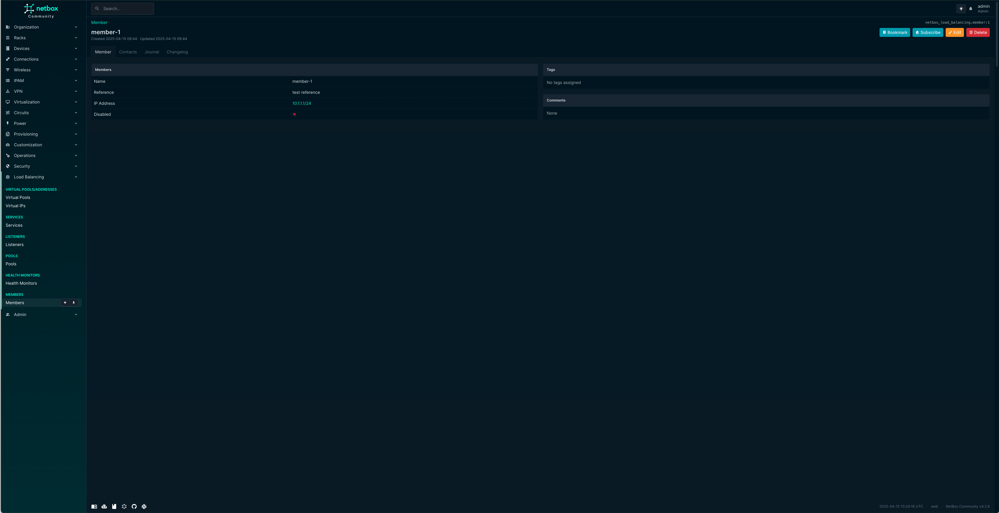


### Load Balancing Health Monitors

Health Monitors are used to monitor the status of a given pool member and take action when a member fails to 
meet the criteria laid out by the monitors parameters.

In Netbox Load Balancing, a health monitor can be assigned to one or more pools.

Health Monitor assignments are stored within the HealthMonitorAssignment table.

#### Permissions

The following Django permissions are applicable to NatPool objects:

| Permission                                  | Action                  |
|---------------------------------------------|-------------------------|
| `netbox_load_balancing.add_healthmonitor`    | Create new view objects |
| `netbox_load_balancing.change_healthmonitor` | Edit view information   |
| `netbox_load_balancing.delete_healthmonitor` | Delete a view object    |
| `netbox_load_balancing.view_healthmonitor`   | View view information   |


#### ScreenShots

Load Balancing Health Monitors
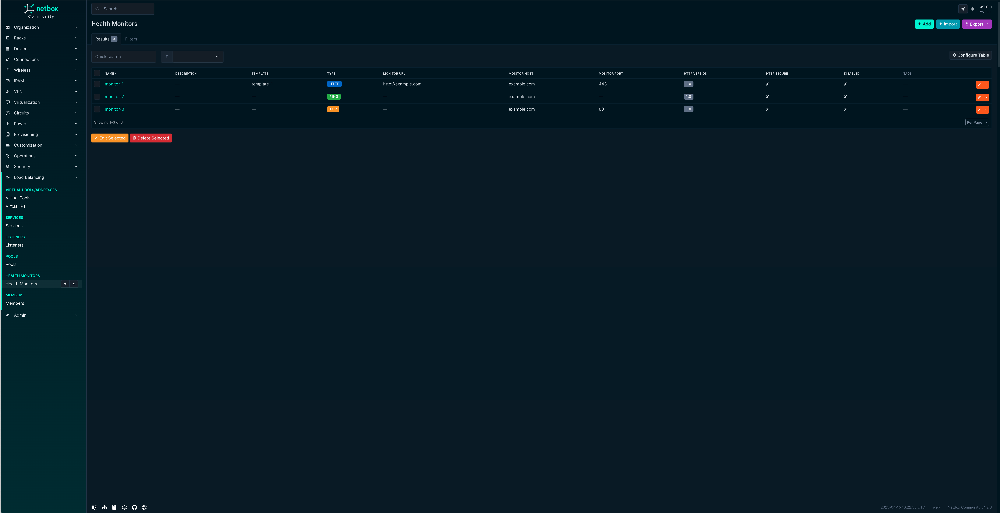
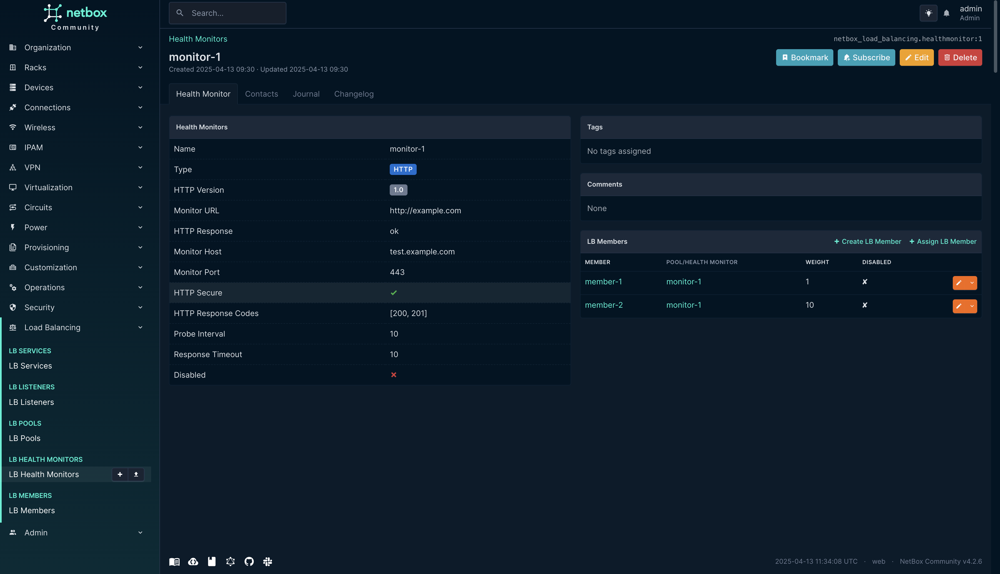
